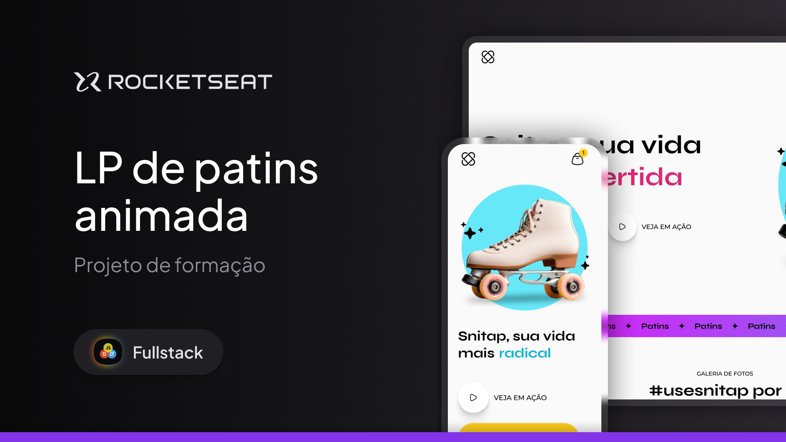

<h1 align="center"> Snitap </h1>

Landing page responsiva desenvolvida com foco em aprimorar os conceitos de animações e transições do css 3.

  <a href="#-tecnologias">Tecnologias</a>&nbsp;&nbsp;&nbsp;|&nbsp;&nbsp;&nbsp;
  <a href="#-projeto">Projeto</a>&nbsp;&nbsp;&nbsp;|&nbsp;&nbsp;&nbsp;
  <a href="#-layout">Layout</a>&nbsp;&nbsp;&nbsp;|&nbsp;&nbsp;&nbsp;
  <a href="#memo-licença">Licença</a>

 

  

## 🚀 Tecnologias

Este projeto foi desenvolvido com as seguintes tecnologias:

- HTML
- CSS animations & transitions
- Git e Github
- Figma

## 💻 Projeto

Esta web page foi desenvolvida durante o curso da trilha de Full Stack para o desenvolvimento de aplicações web ofertado pela [Rocketseat](https://www.rocketseat.com.br) com o intuito pessoal de ampliar meus conhecimentos em tais tecnologias do campo e aprender novos conceitos.

## 🔖 Layout mobile

Você pode visualizar o layout do projeto com mais detalhes através [DESTE LINK](https://www.figma.com/design/H6tlcxITMx8vaacPF7vVGq/LP-de-patins-animada-(Community)?node-id=915-685&t=NEhaFBaVgGNK7xgN-0). É necessário ter conta no [Figma](https://figma.com) para acessá-lo.
